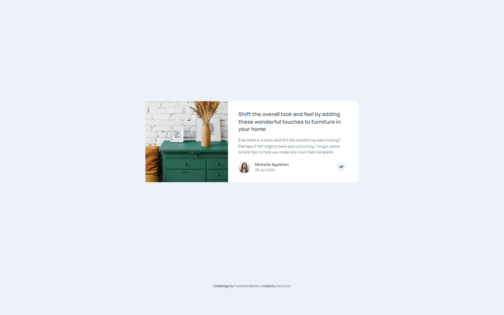
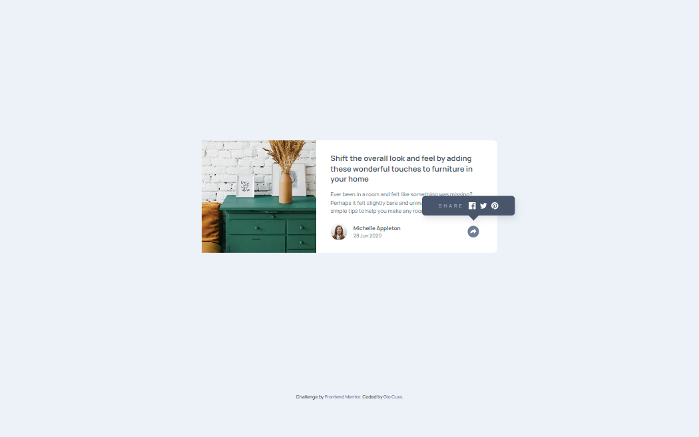
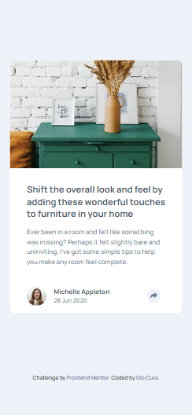
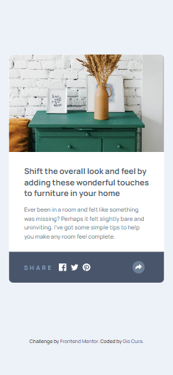

# Frontend Mentor - Article preview component solution

This is a solution to the [Article preview component challenge on Frontend Mentor](https://www.frontendmentor.io/challenges/article-preview-component-dYBN_pYFT).

## Table of contents

- [Overview](#overview)
  - [The challenge](#the-challenge)
  - [Screenshot](#screenshot)
  - [Links](#links)
- [My process](#my-process)
  - [Built with](#built-with)
  - [What I learned](#what-i-learned)
  - [Continued development](#continued-development)
- [Author](#author)

## Overview

### The challenge

Users should be able to:

- View the optimal layout for the component depending on their device's screen size
- See the social media share links when they click the share icon

### Screenshot

### Links

- Solution URL: [Solution](https://github.com/GioCura/FrontEndMentor-Article-Preview-Component)
- Live Site URL: [Live](https://gc8-articlepreview.netlify.app)

## My process

### Built with

- HTML
- CSS
- Flexbox
- Mobile-first workflow

### What I learned

- I learned:

  - how to crop images and shift its position within a container, using object-fit: cover and object-position

  - to set a max-width so that the card won't stretch too much on bigger screens, and would shrink on smaller ones.

  - that along with flex gap, I can add margins/paddings to better match the design mockup.

  - how to hide a tooltip in a mobile layout, by positioning it absolute and giving it a z-index of -1, then reversing that via trigger. I also learned how to measure and adjust its height so that the card won't change dimensions when triggered.

  - to remember to set the overflow to visible when making a tooltip that overlaps the main nesting div.

  - how to set the little arrow of the tooltip 😆. it's actually setting solid border but making three out of four edges transparent.

  - Making the tooltip overflow the card while maintaining the border-radius on the picture side was harder than I thought. I set the card's overflow to visible, and added border-radius and overflow attributes to the image's container. I adjusted that container's width until it matches the width of the image.

### Continued development

- I should improve:

  - my routine of doing the css styles. It's still too scattered for me.

  - my routine of matching dimensions. I could look at Chrome Developer to get the exact pixels instead of just randomly setting the sizes until it fits.

  - how modular my code is. It's good practice to do these from scratch, but when it's time to build a full webpage, I want to speed it up by copying and pasting templates I made.

## Author

- Frontend Mentor - [@GioCura](https://www.frontendmentor.io/profile/GioCura)
